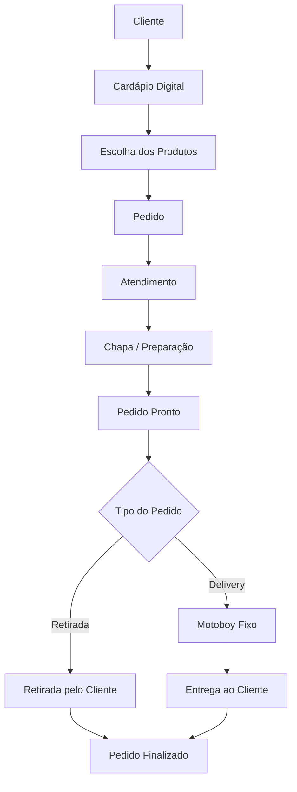

# Entrega 1 — Modelo Conceitual (DER)
### Modelagem de um sistema de gestão de informações para uma organização de pequeno porte

---

## Metadados

- **Murilo Silva Magalhães — RGM: 47820471**
- **Kauê de Lima Pereira — RGM: 48477940**
- **Kauê Gregorio dos Santos — RGM: 47908904**

---

## 1. Caracterização da Organização

- **Nome e natureza da organização:** **Colossal Foods**, empresa privada com fins lucrativos do segmento de alimentação, classificada publicamente como hamburgueria.

- **Contexto e porte:** A Colossal Foods é uma hamburgueria de pequeno/médio porte localizada no Jardim Arantes, em São Paulo. Durante a pesquisa de campo, o grupo identificou **4 funcionários diretamente envolvidos na operação interna**, sendo **2 funcionários na chapa/preparação dos alimentos** e **2 funcionários no atendimento ao público**. A empresa também utiliza **motoboy fixo** para realizar as entregas. A operação envolve atendimento, cardápio digital, recebimento de pedidos, preparação, pagamento, retirada e delivery. O volume médio diário de pedidos não foi informado ao grupo.

- **Problemas e necessidades identificados:** Não foi relatada ao grupo uma crise operacional específica. Para o escopo deste projeto, foi identificada a necessidade de representar de forma estruturada os dados essenciais da operação — clientes, produtos, pedidos, pagamentos e entregas — para permitir rastreabilidade e consistência das informações. O uso de um cardápio digital terceirizado também torna importante distinguir os dados da operação da hamburgueria da plataforma externa que presta o serviço.

- **Justificativa da escolha:** A Colossal Foods foi escolhida por ser uma organização real à qual o grupo possui acesso para pesquisa de campo. Sua operação apresenta processos suficientes para a modelagem conceitual, especialmente pedidos, produtos, pagamentos, retirada e delivery, sem possuir complexidade excessiva para esta primeira etapa do curso.

- **Evidências da organização:** A Colossal Foods possui perfil público no Google, onde aparece como hamburgueria na **Rua do Carvalho Brasileiro, Jardim Arantes, São Paulo — SP, CEP 08382-520**, com telefone público **(11) 95950-6213**. Na consulta pública realizada durante o projeto, o perfil apresentava avaliação 5,0 e 228 avaliações. O grupo também realizou pesquisa de campo diretamente na organização. Fotos da visita devem ser mantidas no repositório como evidência de acesso.

**Referência pública:** pesquisar no Google Maps por **“Colossal Foods — Jardim Arantes, São Paulo — SP”**.

---

## 2. Processos de Negócio

### Principais processos mapeados

1. **Consulta ao cardápio:** o cliente consulta os produtos disponíveis por meio do cardápio digital terceirizado.
2. **Realização do pedido:** o cliente seleciona os produtos e realiza o pedido.
3. **Recebimento e atendimento:** os funcionários do atendimento acompanham o pedido e o encaminham para preparação.
4. **Preparação:** os funcionários da chapa preparam os itens solicitados.
5. **Pagamento:** o pagamento é associado ao pedido realizado.
6. **Retirada:** quando o pedido é para retirada, o cliente recebe o pedido no estabelecimento.
7. **Delivery:** quando o pedido é para entrega, ele é encaminhado ao motoboy fixo.
8. **Finalização:** após a retirada ou entrega, o pedido é considerado concluído.

### Fluxograma

---

## 3. Requisitos do Sistema

### 3.1 Requisitos Funcionais

- **RF01 —** O sistema deve permitir registrar clientes.
- **RF02 —** O sistema deve permitir cadastrar e consultar produtos.
- **RF03 —** O sistema deve permitir organizar produtos por categorias.
- **RF04 —** O sistema deve permitir registrar pedidos.
- **RF05 —** O sistema deve permitir adicionar um ou mais produtos a um pedido.
- **RF06 —** O sistema deve registrar quantidade e preço de cada item do pedido.
- **RF07 —** O sistema deve permitir registrar o pagamento relacionado a um pedido.
- **RF08 —** O sistema deve identificar se o pedido é para retirada ou delivery.
- **RF09 —** O sistema deve permitir registrar os dados de uma entrega.
- **RF10 —** O sistema deve permitir associar o motoboy responsável à entrega.
- **RF11 —** O sistema deve permitir acompanhar o status do pedido e da entrega.
- **RF12 —** O sistema deve manter histórico dos pedidos realizados.

### 3.2 Requisitos Não Funcionais

- **RNF01 — Usabilidade:** o sistema deve ser simples e adequado à rotina de uma operação de pequeno/médio porte.
- **RNF02 — Segurança:** o acesso aos dados de clientes e pedidos deve ser controlado.
- **RNF03 — Disponibilidade:** o sistema deve estar disponível durante o horário de funcionamento da hamburgueria.
- **RNF04 — Desempenho:** registros e consultas de pedidos devem ocorrer sem atrasos que prejudiquem o atendimento.
- **RNF05 — Integridade:** os relacionamentos entre pedidos, produtos, pagamentos e entregas devem permanecer consistentes.
- **RNF06 — Privacidade:** dados pessoais de clientes devem ser usados somente para as finalidades necessárias ao atendimento e à entrega.

---

## 4. Regras de Negócio

### Regras operacionais

- **RN01 —** Um cliente pode realizar vários pedidos.
- **RN02 —** Todo pedido deve possuir pelo menos um item.
- **RN03 —** Um pedido pode conter vários produtos.
- **RN04 —** Um mesmo produto pode estar presente em vários pedidos.
- **RN05 —** Cada produto deve pertencer a uma categoria.
- **RN06 —** Todo item do pedido deve possuir quantidade maior que zero.
- **RN07 —** Todo pagamento deve estar associado a um pedido.
- **RN08 —** Um pedido pode possuir um ou mais registros de pagamento, permitindo representar pagamento dividido.
- **RN09 —** Um pedido deve ser classificado como retirada ou delivery.
- **RN10 —** Pedidos para retirada não necessitam de registro de entrega.
- **RN11 —** Pedidos de delivery devem possuir uma entrega associada.
- **RN12 —** Cada entrega deve estar relacionada a um motoboy responsável.
- **RN13 —** Um motoboy pode realizar várias entregas ao longo do tempo.
- **RN14 —** Uma entrega deve possuir endereço de destino.
- **RN15 —** Um pedido de delivery somente deve ser considerado entregue após a conclusão da entrega.

### Restrições organizacionais

- O cardápio digital utilizado pela Colossal Foods é fornecido por uma **empresa terceirizada**, contratada mediante pagamento mensal.
- O grupo não possui acesso ao banco de dados interno dessa plataforma.
- A empresa utiliza **motoboy fixo** para o processo de delivery.
- A operação interna observada possui **2 funcionários na chapa** e **2 funcionários no atendimento ao público**.
- A modelagem representa os dados necessários aos processos observados e não pretende reproduzir a implementação interna do sistema terceirizado.

---

## 5. Dicionário de Dados Conceitual (Preliminar)

O dicionário de dados completo está disponível no arquivo abaixo:

[Dicionário de Dados em HTML](dicionario-dados.html)

| Atributo | Descrição | Regra de negócio associada |
|---|---|---|
| id_categoria | Identificador da categoria | Deve ser único |
| nome | Nome da categoria | Obrigatório |
| descricao | Descrição da categoria | Opcional |

### PRODUTO

| Atributo | Descrição | Regra de negócio associada |
|---|---|---|
| id_produto | Identificador do produto | Deve ser único |
| nome | Nome apresentado no cardápio | Obrigatório |
| descricao | Características do produto | Opcional |
| preco | Valor de venda | Deve ser maior que zero |
| status | Indica disponibilidade | Ex.: ativo ou indisponível |

### PEDIDO

| Atributo | Descrição | Regra de negócio associada |
|---|---|---|
| id_pedido | Identificador do pedido | Deve ser único |
| data_hora | Momento em que o pedido foi registrado | Obrigatório |
| tipo_pedido | Forma de recebimento | Retirada ou delivery |
| status | Situação atual do pedido | Ex.: recebido, em preparação, pronto, finalizado |
| valor_total | Valor total do pedido | Calculado a partir dos itens |

### PAGAMENTO

| Atributo | Descrição | Regra de negócio associada |
|---|---|---|
| id_pagamento | Identificador do pagamento | Deve ser único |
| forma_pagamento | Meio utilizado para pagar | Ex.: PIX, dinheiro ou cartão |
| valor | Valor registrado no pagamento | Deve ser maior que zero |
| status | Situação do pagamento | Ex.: pendente ou confirmado |

### MOTOBOY

| Atributo | Descrição | Regra de negócio associada |
|---|---|---|
| id_motoboy | Identificador do motoboy | Deve ser único |
| nome | Nome do responsável pela entrega | Obrigatório |
| telefone | Telefone para contato | Utilizado quando necessário |
| status | Situação do motoboy | Ex.: disponível ou em entrega |

### ENTREGA

| Atributo | Descrição | Regra de negócio associada |
|---|---|---|
| id_entrega | Identificador da entrega | Deve ser único |
| endereco_entrega | Local onde o pedido será entregue | Obrigatório para delivery |
| data_hora_saida | Momento em que o pedido saiu | Registrado ao iniciar a entrega |
| data_hora_entrega | Momento da conclusão | Registrado após a entrega |
| status | Situação da entrega | Ex.: aguardando, em rota ou entregue |

> **Privacidade:** os atributos acima representam a estrutura conceitual. Nenhum dado pessoal real de clientes ou funcionários foi utilizado como exemplo.

---

## 6. Modelagem Conceitual (Entidades, Atributos, Relacionamentos)

### Entidades reconhecidas

- **CLIENTE:** representa a pessoa que realiza o pedido.
- **PEDIDO:** representa a compra e concentra as principais informações da operação.
- **ITEM_PEDIDO:** representa cada produto incluído em determinado pedido.
- **PRODUTO:** representa os itens comercializados pela hamburgueria.
- **CATEGORIA:** organiza os produtos disponíveis no cardápio.
- **PAGAMENTO:** representa os registros financeiros associados a um pedido.
- **MOTOBOY:** representa o responsável pelo processo de entrega.
- **ENTREGA:** representa a entrega de um pedido do tipo delivery.

### Atributos e classificações

Os atributos foram definidos no Dicionário de Dados Conceitual da Seção 5. Os identificadores (`id_...`) distinguem cada ocorrência de entidade; os demais atributos descrevem características necessárias aos processos observados.

### Relacionamentos pertinentes

- **CLIENTE 1:N PEDIDO** — um cliente pode realizar vários pedidos.
- **PEDIDO 1:N ITEM_PEDIDO** — um pedido possui um ou mais itens.
- **PRODUTO 1:N ITEM_PEDIDO** — um produto pode aparecer em vários itens de pedidos.
- **CATEGORIA 1:N PRODUTO** — uma categoria pode classificar vários produtos.
- **PEDIDO 1:N PAGAMENTO** — um pedido pode possuir um ou mais registros de pagamento.
- **PEDIDO 1:0..1 ENTREGA** — somente pedidos de delivery geram entrega.
- **MOTOBOY 1:N ENTREGA** — um motoboy pode realizar várias entregas.

O relacionamento muitos-para-muitos entre **PEDIDO** e **PRODUTO** é resolvido pela entidade associativa **ITEM_PEDIDO**.

### Restrições e políticas aplicadas

- Pedidos devem possuir pelo menos um item.
- Entrega só existe para pedidos do tipo delivery.
- Toda entrega deve possuir motoboy responsável e endereço de destino.
- Dados de contato dos clientes devem ser utilizados apenas para atendimento e entrega.
- A plataforma terceirizada de cardápio não foi modelada como entidade principal, pois é um sistema externo à estrutura conceitual proposta.

---

## 7. Diagrama Entidade-Relacionamento (DER)

O DER conceitual está anexado no repositório:

O diagrama representa:

- Entidades;
- Atributos principais;
- Relacionamentos;
- Cardinalidades;
- Entidade associativa ITEM_PEDIDO.

---

## 8. Justificativa Técnica

A entidade **PEDIDO** ocupa posição central no modelo porque representa a principal operação analisada na hamburgueria. Ela conecta o cliente, os itens adquiridos, os pagamentos e, quando necessário, a entrega.

A relação entre **PEDIDO** e **PRODUTO** é naturalmente muitos-para-muitos: um pedido pode conter vários produtos e o mesmo produto pode aparecer em diversos pedidos. Por isso foi criada a entidade associativa **ITEM_PEDIDO**, que também permite registrar quantidade, preço praticado no momento da compra e observações específicas.

A entidade **CATEGORIA** foi separada de PRODUTO para evitar repetição de classificações e permitir organização do cardápio.

A entidade **PAGAMENTO** foi separada de PEDIDO porque possui características próprias e porque um pedido pode, conceitualmente, possuir mais de um registro de pagamento.

As entidades **ENTREGA** e **MOTOBOY** foram utilizadas porque o delivery é um processo real da organização. ENTREGA não foi incorporada diretamente a PEDIDO porque pedidos para retirada não precisam de endereço, horário de saída ou motoboy. Assim, um pedido pode gerar zero ou uma entrega, enquanto um motoboy pode realizar várias entregas.

O endereço de destino foi associado à **ENTREGA** em vez de ser armazenado como atributo obrigatório do CLIENTE, pois um cliente pode realizar pedidos para locais diferentes e pedidos para retirada não necessitam desse dado.

O cardápio digital terceirizado não foi transformado em entidade porque ele representa uma ferramenta externa contratada pela organização, e não um objeto de informação central do modelo conceitual proposto.

A modelagem busca reduzir redundâncias, representar as regras observadas e permitir evolução posterior para o modelo lógico e implementação de banco de dados relacional.

---

## 9. Uso de Inteligência Artificial

O grupo utilizou **ChatGPT, da OpenAI**, como ferramenta de apoio durante o projeto.

### Uso 1 — Preparação da entrevista

| Item | Registro |
|---|---|
| **Ferramenta e etapa** | ChatGPT — preparação das perguntas de levantamento de requisitos |
| **Motivação** | Identificar perguntas importantes para compreender como os dados circulam na hamburgueria |
| **Prompt utilizado** | “Chat, preciso fazer uma entrevista com uma empresa e entender como funciona o sistema deles de dados e montar um fluxo e fazer um MER e DER.” |
| **Resposta recebida** | Sugestões de perguntas sobre pedidos, produtos, clientes, pagamentos, sistemas, estoque e delivery |
| **Fontes consultadas e verificadas** | As sugestões foram confrontadas com a pesquisa de campo e com o funcionamento observado na Colossal Foods |
| **Trechos rejeitados ou corrigidos** | Hipóteses não confirmadas, como integração automática de estoque e uso obrigatório de determinadas plataformas, foram retiradas |
| **Justificativa da escolha final** | Foram mantidas apenas questões úteis para compreender os processos realmente acessíveis ao grupo |
| **Reflexão crítica** | A IA tende a sugerir práticas comuns do setor como se pudessem fazer parte da empresa analisada; por isso a validação em campo foi indispensável |

### Uso 2 — Estruturação do modelo

| Item | Registro |
|---|---|
| **Ferramenta e etapa** | ChatGPT — organização dos requisitos, entidades, relacionamentos e cardinalidades |
| **Motivação** | Transformar as informações coletadas em uma estrutura inicial de modelagem conceitual |
| **Prompt utilizado** | “A empresa que vou é uma hamburgueria de baixo/médio porte, é possível adiantar algo?” |
| **Resposta recebida** | Sugestões iniciais de entidades como Cliente, Pedido, Produto, Item do Pedido, Pagamento, Entrega e Motoboy |
| **Fontes consultadas e verificadas** | Entrevista, observação da operação e informações públicas da organização |
| **Trechos rejeitados ou corrigidos** | Foram removidas entidades e funcionalidades sem confirmação ou fora do escopo, como estoque automático de ingredientes |
| **Justificativa da escolha final** | O grupo manteve apenas elementos coerentes com os processos observados e com o objetivo da Entrega 1 |
| **Reflexão crítica** | As sugestões da IA foram tratadas como hipóteses e não como evidências sobre o funcionamento real da organização |

### Uso 3 — Documentação no GitHub

| Item | Registro |
|---|---|
| **Ferramenta e etapa** | ChatGPT — estruturação e revisão do README |
| **Motivação** | Adaptar as informações do projeto ao modelo de entrega fornecido pelo professor |
| **Prompt utilizado** | “Mude o arquivo para esse formato: Entrega 1 — Modelo Conceitual (DER).” |
| **Resposta recebida** | Organização do conteúdo nas seções de caracterização, processos, requisitos, regras, dicionário, modelagem e justificativa |
| **Fontes consultadas e verificadas** | Modelo oficial da atividade, pesquisa de campo e perfil público da Colossal Foods |
| **Trechos rejeitados ou corrigidos** | Foram removidos conteúdos fora do modelo solicitado e afirmações que não haviam sido confirmadas |
| **Justificativa da escolha final** | A versão final preserva os títulos e critérios definidos na atividade e utiliza a IA apenas como apoio à organização |
| **Reflexão crítica** | O conteúdo gerado precisou de revisão humana para manter fidelidade ao levantamento de campo e evitar generalizações |

---

## Critérios Atitudinais (20%)

Os critérios atitudinais serão demonstrados por meio da participação dos integrantes, do cumprimento das responsabilidades, da colaboração no projeto e do histórico de commits no GitHub.

Para demonstrar colaboração equilibrada, cada integrante deve realizar contribuições reais no repositório utilizando sua própria conta.

---

## Resumo dos Pesos

| Dimensão | Peso total |
|----------|-----------|
| Conceitual (contexto, requisitos/regras, modelagem, justificativa técnica) | 30% |
| Procedimental (requisitos, fluxogramas, dicionário de dados, DER) | 50% |
| Atitudinal (participação, comprometimento, colaboração, autonomia) | 20% |

**Entrega final:** `README.md` completo + DER em imagem + Dicionário de Dados em HTML anexados ao repositório GitHub do grupo.
