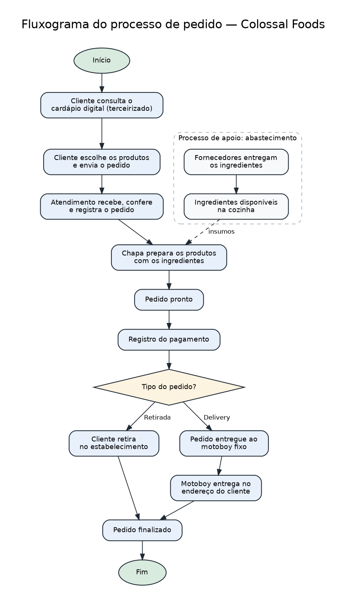
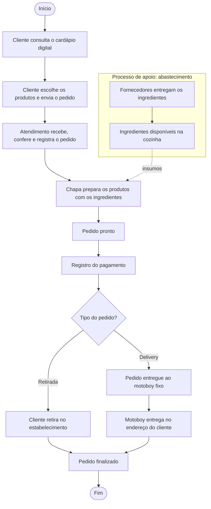
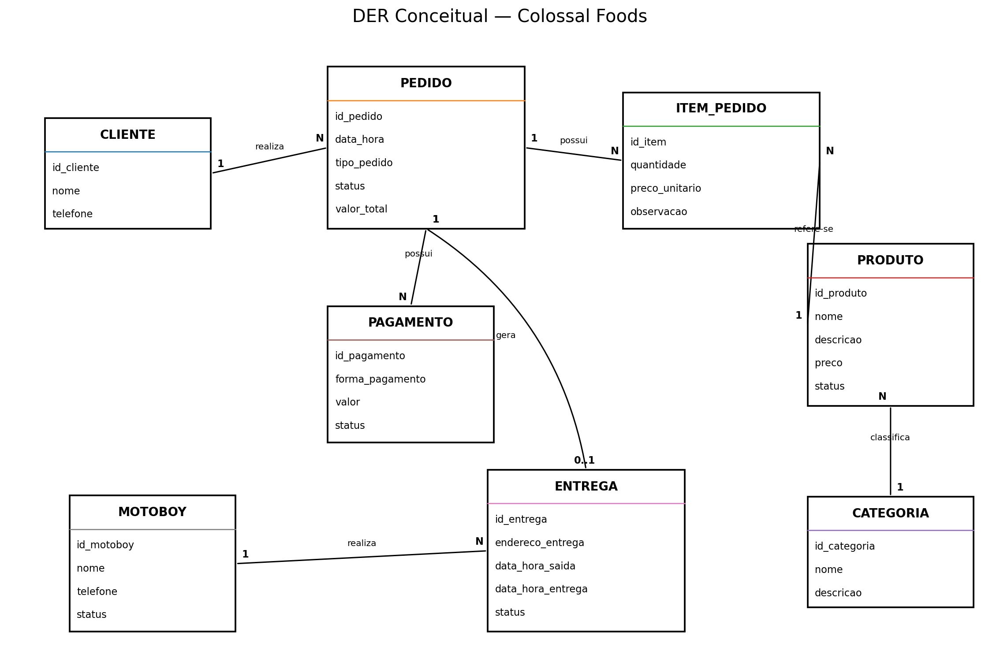

# Entrega 1 — Modelo Conceitual (DER)
### Modelagem de um sistema de gestão de informações para uma organização de pequeno porte

---

## Metadados

- **Murilo Silva Magalhães — RGM: 47820471**
- **Kauê de Lima Pereira — RGM: 48477940**
- **Kauê Gregorio dos Santos — RGM: 47908904**

### Estrutura do repositório

| Arquivo | Conteúdo |
|---|---|
| `README.md` | Documentação completa da entrega |
| `dicionario-dados.html` | Dicionário de dados conceitual completo |
| `diagramas/DER-Colossal-Foods.png` | Diagrama Entidade-Relacionamento conceitual |
| `diagramas/fluxograma-Colossal-Foods.png` | Fluxograma do processo de pedido |
| `diagramas/gerar_der.py` e `diagramas/fluxograma.dot` | Arquivos-fonte usados para gerar os diagramas |

---

## 1. Caracterização da Organização

- **Nome e natureza da organização:** **Colossal Foods**, empresa privada com fins lucrativos do segmento de alimentação, classificada publicamente como hamburgueria.

- **Contexto e porte:** hamburgueria de pequeno/médio porte localizada no Jardim Arantes, em São Paulo. Durante a pesquisa de campo, o grupo identificou **4 funcionários diretamente envolvidos na operação interna**: **2 na chapa/preparação dos alimentos** e **2 no atendimento ao público**. A empresa também conta com **motoboy fixo** para as entregas. A operação envolve cardápio digital, recebimento de pedidos, preparação, pagamento, retirada, delivery e o abastecimento de ingredientes junto a fornecedores. O volume médio diário de pedidos não foi informado ao grupo.

- **Problemas e necessidades identificados:** não foi relatada ao grupo uma crise operacional específica. Para o escopo deste projeto, identificou-se a necessidade de representar de forma estruturada os dados essenciais da operação — clientes, produtos do cardápio, pedidos, pagamentos, entregas, ingredientes e fornecedores — para garantir rastreabilidade e consistência das informações. Como o cardápio digital é terceirizado, também é importante separar os dados da operação da hamburgueria da plataforma externa que presta o serviço.

- **Justificativa da escolha:** a Colossal Foods foi escolhida por ser uma organização real à qual o grupo tem acesso para pesquisa de campo. Sua operação apresenta processos suficientes para a modelagem conceitual (pedido, produção, pagamento, retirada, delivery e abastecimento) sem complexidade excessiva para esta primeira etapa.

-  **Evidências da organização:** o grupo realizou pesquisa de campo diretamente na organização, por meio de entrevista com a equipe. Não foram registradas fotos durante a visita; a existência da organização pode ser verificada pelos dados públicos abaixo, obtidos no perfil da empresa no Google Maps.

| Dado | Informação |
|---|---|
| **Nome** | Colossal Foods |
| **Segmento** | Hamburgueria (alimentação) |
| **Natureza** | Empresa privada com fins lucrativos |
| **Endereço** | Rua do Carvalho Brasileiro, Jardim Arantes — São Paulo/SP |
| **CEP** | 08382-520 |
| **Telefone** | (11) 95950-6213 |
| **Avaliação no Google** | 5,0 (228 avaliações, na consulta feita durante o projeto) |
| **Equipe observada** | 2 funcionários na chapa, 2 no atendimento e 1 motoboy fixo |
| **Cardápio** | Digital, fornecido por empresa terceirizada |
| **Referência pública** | Pesquisar no Google Maps por “Colossal Foods — Jardim Arantes, São Paulo — SP” |

---

## 2. Processos de Negócio

### Principais processos mapeados

1. **Consulta ao cardápio:** o cliente consulta os produtos disponíveis no cardápio digital terceirizado.
2. **Realização do pedido:** o cliente escolhe os produtos e envia o pedido.
3. **Recebimento e atendimento:** a equipe de atendimento recebe, confere e registra o pedido, encaminhando-o para a chapa.
4. **Preparação:** a equipe da chapa prepara os produtos utilizando os ingredientes disponíveis.
5. **Pagamento:** o pagamento é registrado e associado ao pedido.
6. **Retirada:** quando o pedido é para retirada, o cliente o recebe no estabelecimento.
7. **Delivery:** quando o pedido é para entrega, ele é passado ao motoboy fixo, que o leva até o endereço do cliente.
8. **Finalização:** após a retirada ou a entrega, o pedido é considerado concluído.
9. **Abastecimento (processo de apoio):** fornecedores entregam os ingredientes usados na preparação.

### Fluxograma

Versão em Mermaid (renderizada pelo GitHub)

---

## 3. Requisitos do Sistema

### 3.1 Requisitos Funcionais

- **RF01 —** O sistema deve permitir registrar clientes.
- **RF02 —** O sistema deve permitir cadastrar, consultar e marcar como indisponíveis os produtos do cardápio.
- **RF03 —** O sistema deve permitir organizar os produtos por categorias.
- **RF04 —** O sistema deve permitir registrar pedidos.
- **RF05 —** O sistema deve permitir incluir um ou mais produtos em um pedido, com quantidade, preço praticado e observação.
- **RF06 —** O sistema deve calcular o valor total do pedido a partir dos produtos incluídos.
- **RF07 —** O sistema deve permitir registrar o pagamento de um pedido.
- **RF08 —** O sistema deve identificar se o pedido é para retirada ou delivery.
- **RF09 —** O sistema deve permitir registrar os dados de uma entrega e associar o motoboy responsável.
- **RF10 —** O sistema deve permitir acompanhar o status do pedido e da entrega.
- **RF11 —** O sistema deve permitir cadastrar ingredientes e registrar quais ingredientes compõem cada produto.
- **RF12 —** O sistema deve permitir cadastrar fornecedores e relacioná-los aos ingredientes que fornecem.
- **RF13 —** O sistema deve manter o histórico dos pedidos realizados.

### 3.2 Requisitos Não Funcionais

- **RNF01 — Usabilidade:** o sistema deve ser simples e adequado à rotina de uma operação de pequeno/médio porte.
- **RNF02 — Segurança:** o acesso aos dados de clientes, pedidos e pagamentos deve ser controlado.
- **RNF03 — Disponibilidade:** o sistema deve estar disponível durante todo o horário de funcionamento da hamburgueria.
- **RNF04 — Desempenho:** o registro e a consulta de pedidos devem ocorrer sem atrasos que prejudiquem o atendimento.
- **RNF05 — Integridade:** os relacionamentos entre pedidos, produtos, ingredientes, pagamentos e entregas devem permanecer consistentes.
- **RNF06 — Privacidade:** dados pessoais de clientes devem ser usados somente para atendimento e entrega, em conformidade com a LGPD.

---

## 4. Regras de Negócio

### Regras operacionais

- **RN01 —** Um cliente pode realizar vários pedidos; cada pedido pertence a um único cliente.
- **RN02 —** Todo pedido deve conter pelo menos um produto.
- **RN03 —** Um mesmo produto pode estar presente em vários pedidos.
- **RN04 —** Cada produto pertence a exatamente uma categoria.
- **RN05 —** Um produto indisponível não pode ser incluído em novos pedidos.
- **RN06 —** A quantidade de cada produto no pedido deve ser maior que zero.
- **RN07 —** O preço registrado no pedido é o praticado no momento da venda, mesmo que o preço do produto mude depois.
- **RN08 —** Cada pedido possui no máximo um pagamento, e cada pagamento se refere a um único pedido; o valor pago deve ser igual ao valor total do pedido.
- **RN09 —** Todo pedido deve ser classificado como retirada ou delivery.
- **RN10 —** Pedidos para retirada não possuem registro de entrega.
- **RN11 —** Pedidos de delivery devem possuir exatamente uma entrega associada.
- **RN12 —** Cada entrega deve ter um motoboy responsável; um motoboy pode realizar várias entregas.
- **RN13 —** Toda entrega deve possuir endereço de destino.
- **RN14 —** Um pedido de delivery só é considerado finalizado após a conclusão da entrega.
- **RN15 —** Um produto preparado é composto por um ou mais ingredientes; produtos industrializados (ex.: refrigerante em lata) podem não ter composição cadastrada.
- **RN16 —** Um ingrediente pode ser fornecido por um ou mais fornecedores, e um fornecedor pode fornecer vários ingredientes.

### Restrições organizacionais

- O cardápio digital é fornecido por uma **empresa terceirizada**, contratada mediante pagamento mensal.
- O grupo não possui acesso ao banco de dados interno dessa plataforma.
- A empresa utiliza **motoboy fixo** para o delivery.
- A operação interna observada possui **2 funcionários na chapa** e **2 funcionários no atendimento**.
- A modelagem representa os dados necessários aos processos observados e não pretende reproduzir a implementação interna do sistema terceirizado.
- O controle automático de estoque não faz parte do escopo, pois não foi confirmado durante a pesquisa de campo.

---

## 5. Dicionário de Dados Conceitual (Preliminar)

O dicionário completo, com tipo de atributo, domínio, obrigatoriedade e regras associadas, está em:

**[📄 dicionario-dados.html](dicionario-dados.html)**

Resumo por entidade (🔑 = identificador):

### CLIENTE
| Atributo | Descrição | Regra de negócio associada |
|---|---|---|
| 🔑 id_cliente | Identificador do cliente | Único |
| nome | Nome do cliente | Obrigatório |
| telefone | Telefone para contato | Uso restrito a atendimento e entrega (RNF06) |

### PEDIDO
| Atributo | Descrição | Regra de negócio associada |
|---|---|---|
| 🔑 id_pedido | Identificador do pedido | Único |
| data_hora | Momento em que o pedido foi registrado | Obrigatório |
| tipo_pedido | Forma de recebimento | Retirada ou delivery (RN09) |
| status | Situação atual do pedido | Recebido, em preparação, pronto ou finalizado |
| valor_total *(derivado)* | Valor total do pedido | Soma de quantidade × preco_unitario dos produtos |

### PRODUTO
| Atributo | Descrição | Regra de negócio associada |
|---|---|---|
| 🔑 id_produto | Identificador do produto | Único |
| nome | Nome exibido no cardápio | Obrigatório |
| descricao | Descrição do produto | Opcional |
| preco | Preço de venda atual | Maior que zero |
| disponivel | Indica se pode ser pedido | Indisponível não entra em novos pedidos (RN05) |

### CATEGORIA
| Atributo | Descrição | Regra de negócio associada |
|---|---|---|
| 🔑 id_categoria | Identificador da categoria | Único |
| nome | Nome da categoria | Obrigatório, sem repetição |
| descricao | Descrição da categoria | Opcional |

### INGREDIENTE
| Atributo | Descrição | Regra de negócio associada |
|---|---|---|
| 🔑 id_ingrediente | Identificador do ingrediente | Único |
| nome | Nome do ingrediente | Obrigatório |
| unidade_medida | Unidade de medida | Ex.: g, kg, unidade, litro |

### FORNECEDOR
| Atributo | Descrição | Regra de negócio associada |
|---|---|---|
| 🔑 id_fornecedor | Identificador do fornecedor | Único |
| nome | Nome ou razão social | Obrigatório |
| telefone | Telefone para contato | Opcional |
| email | E-mail para contato | Opcional |

### PAGAMENTO
| Atributo | Descrição | Regra de negócio associada |
|---|---|---|
| 🔑 id_pagamento | Identificador do pagamento | Único |
| forma_pagamento | Meio utilizado | PIX, dinheiro, débito ou crédito |
| valor | Valor pago | Igual ao valor total do pedido (RN08) |
| data_hora | Momento do pagamento | Obrigatório |

### ENTREGA
| Atributo | Descrição | Regra de negócio associada |
|---|---|---|
| 🔑 id_entrega | Identificador da entrega | Único |
| endereco_entrega *(composto)* | Destino: logradouro, numero, bairro, complemento | Obrigatório (RN13) |
| data_hora_saida | Momento da saída do motoboy | Preenchido ao iniciar a entrega |
| data_hora_entrega | Momento da conclusão | Posterior à saída |
| status | Situação da entrega | Aguardando, em rota ou entregue |

### MOTOBOY
| Atributo | Descrição | Regra de negócio associada |
|---|---|---|
| 🔑 id_motoboy | Identificador do motoboy | Único |
| nome | Nome do motoboy | Obrigatório |
| telefone | Telefone para contato | Obrigatório |

### Atributos de relacionamento
| Relacionamento | Atributo | Descrição | Regra |
|---|---|---|---|
| CONTÉM | quantidade | Quantidade do produto no pedido | Maior que zero (RN06) |
| CONTÉM | preco_unitario | Preço praticado na venda | Preço no momento do pedido (RN07) |
| CONTÉM | observacao | Pedido especial (ex.: sem cebola) | Opcional |
| COMPÕE | quantidade_utilizada | Quanto do ingrediente vai em uma unidade do produto | Maior que zero |

> **Privacidade:** os atributos acima representam apenas a estrutura conceitual. Nenhum dado pessoal real de clientes, funcionários ou fornecedores foi utilizado.

---

## 6. Modelagem Conceitual (Entidades, Atributos, Relacionamentos)

### Entidades reconhecidas

- **CLIENTE:** pessoa que realiza pedidos.
- **PEDIDO:** solicitação de compra; entidade central do modelo.
- **PRODUTO:** item vendido no cardápio.
- **CATEGORIA:** agrupamento dos produtos no cardápio.
- **INGREDIENTE:** insumo utilizado na preparação dos produtos.
- **FORNECEDOR:** quem fornece ingredientes à hamburgueria.
- **PAGAMENTO:** registro financeiro da quitação de um pedido.
- **ENTREGA:** deslocamento de um pedido de delivery até o cliente.
- **MOTOBOY:** entregador fixo responsável pelas entregas.

### Atributos e classificações

Os atributos estão detalhados na Seção 5 e no dicionário HTML. O modelo utiliza:

- **Identificadores** (`id_...`), que distinguem cada ocorrência das entidades;
- **Atributos simples**, como `nome`, `preco` e `status`;
- **Atributo composto:** `endereco_entrega` (logradouro, número, bairro, complemento);
- **Atributo derivado:** `valor_total`, calculado a partir dos produtos do pedido;
- **Atributos de relacionamento:** `quantidade`, `preco_unitario` e `observacao` em CONTÉM, e `quantidade_utilizada` em COMPÕE.

### Relacionamentos pertinentes

Cardinalidade no formato **(mín, máx)**: o par ao lado de uma entidade indica quantas ocorrências dela se associam a **uma** ocorrência da entidade do outro lado.

| Relacionamento | Entidades e cardinalidades | Tipo |
|---|---|---|
| **REALIZA** | CLIENTE (1,1) — PEDIDO (0,N) | 1:N |
| **CONTÉM** | PEDIDO (0,N) — PRODUTO (1,N) | N:N |
| **CLASSIFICA** | CATEGORIA (1,1) — PRODUTO (0,N) | 1:N |
| **COMPÕE** | PRODUTO (0,N) — INGREDIENTE (0,N) | N:N |
| **FORNECE** | FORNECEDOR (1,N) — INGREDIENTE (1,N) | N:N |
| **POSSUI** | PEDIDO (1,1) — PAGAMENTO (0,1) | 1:1 |
| **GERA** | PEDIDO (1,1) — ENTREGA (0,1) | 1:1 |
| **TRANSPORTA** | MOTOBOY (1,1) — ENTREGA (0,N) | 1:N |

Os relacionamentos muitos-para-muitos (CONTÉM, COMPÕE e FORNECE) são mantidos diretamente no modelo conceitual. A transformação deles em tabelas associativas será feita apenas na etapa de modelagem lógica.

### Restrições e políticas aplicadas

- Todo pedido deve conter pelo menos um produto.
- Entrega só existe para pedidos do tipo delivery.
- Toda entrega deve ter motoboy responsável e endereço de destino.
- Dados de contato dos clientes são usados apenas para atendimento e entrega.
- A plataforma terceirizada de cardápio não foi modelada como entidade, pois é um sistema externo.

---

## 7. Diagrama Entidade-Relacionamento (DER)

O diagrama utiliza a notação de Peter Chen com atributos (estilo brModelo) e representa:

- entidades (retângulos) e relacionamentos (losangos);
- atributos, com identificadores em destaque (círculo preenchido), atributo composto e atributo derivado (círculo tracejado);
- atributos de relacionamento em CONTÉM e COMPÕE;
- cardinalidades mínimas e máximas em todos os relacionamentos.

---

## 8. Justificativa Técnica

A entidade **PEDIDO** ocupa posição central porque representa a principal operação da hamburgueria: ela conecta o cliente, os produtos vendidos, o pagamento e, quando necessário, a entrega.

**PRODUTO** e **INGREDIENTE** foram modelados como entidades distintas porque representam coisas diferentes. O cliente pede **produtos** do cardápio (um lanche, uma porção, uma bebida), enquanto a cozinha consome **ingredientes** para prepará-los. Ligar o pedido diretamente aos ingredientes eliminaria o cardápio do modelo, que é justamente o ponto de partida do processo. Por isso o pedido se relaciona com PRODUTO (**CONTÉM**) e o produto se relaciona com INGREDIENTE (**COMPÕE**).

Os relacionamentos N:N foram mantidos no nível conceitual, sem entidade associativa. As informações que dependem da combinação pedido–produto — **quantidade**, **preço praticado** e **observação** — foram representadas como **atributos do relacionamento CONTÉM**. O preço praticado precisa ser guardado no relacionamento porque o preço do produto pode mudar depois da venda, e o histórico do pedido não pode ser alterado por isso. Pelo mesmo motivo, a quantidade de cada ingrediente usada em um produto é atributo de **COMPÕE**.

**CATEGORIA** foi separada de PRODUTO para evitar repetição de classificações e permitir organizar o cardápio.

**FORNECEDOR** foi incluído porque os ingredientes precisam ser obtidos de terceiros. O relacionamento **FORNECE** é N:N, pois um fornecedor pode fornecer vários ingredientes e um mesmo ingrediente pode ser comprado de fornecedores diferentes. O controle automático de estoque ficou fora do escopo, já que não foi confirmado em campo.

**PAGAMENTO** foi separada de PEDIDO porque tem características próprias (forma, valor, momento) e porque o pedido existe antes de ser pago. Por isso a cardinalidade é PEDIDO (1,1) — PAGAMENTO (0,1): o pedido pode ainda não ter pagamento, mas todo pagamento pertence a exatamente um pedido.

**ENTREGA** não foi incorporada a PEDIDO porque pedidos para retirada não precisam de endereço, horário de saída ou motoboy. Assim, um pedido gera zero ou uma entrega. O endereço fica na ENTREGA, e não no CLIENTE, porque o mesmo cliente pode pedir para endereços diferentes. Ele foi modelado como **atributo composto** para permitir consultas por bairro, por exemplo.

**MOTOBOY** foi mantido porque é um elemento real do delivery observado. O relacionamento recebeu o nome **TRANSPORTA** para não ser confundido com a entidade ENTREGA.

O **valor_total** do pedido foi marcado como **derivado**, pois pode ser calculado a partir dos produtos e seus preços praticados.

O cardápio digital terceirizado não virou entidade porque é uma ferramenta externa contratada, e não um objeto de informação da organização.

A modelagem busca reduzir redundâncias, representar as regras observadas e permitir a evolução para o modelo lógico e a implementação em banco de dados relacional.

---

## 9. Uso de Inteligência Artificial

O grupo utilizou **ChatGPT (OpenAI)** e **Claude (Anthropic)** como ferramentas de apoio.

### Uso 1 — Preparação da entrevista

| Item | Registro |
|---|---|
| **Ferramenta e etapa** | ChatGPT — preparação das perguntas de levantamento de requisitos |
| **Motivação** | Identificar perguntas importantes para entender como os dados circulam na hamburgueria |
| **Prompt utilizado** | “Chat, preciso fazer uma entrevista com uma empresa e entender como funciona o sistema deles de dados e montar um fluxo e fazer um MER e DER.” |
| **Resposta recebida** | Sugestões de perguntas sobre pedidos, produtos, clientes, pagamentos, sistemas, estoque e delivery |
| **Fontes consultadas e verificadas** | As sugestões foram confrontadas com a pesquisa de campo na Colossal Foods |
| **Trechos rejeitados ou corrigidos** | Hipóteses não confirmadas, como integração automática de estoque, foram retiradas |
| **Justificativa da escolha final** | Foram mantidas apenas perguntas úteis para os processos acessíveis ao grupo |
| **Reflexão crítica** | A IA tende a sugerir práticas comuns do setor como se fizessem parte da empresa analisada; a validação em campo foi indispensável |

### Uso 2 — Estruturação inicial do modelo

| Item | Registro |
|---|---|
| **Ferramenta e etapa** | ChatGPT — organização de requisitos, entidades, relacionamentos e cardinalidades |
| **Motivação** | Transformar as informações coletadas em uma estrutura inicial de modelagem |
| **Prompt utilizado** | “A empresa que vou é uma hamburgueria de baixo/médio porte, é possível adiantar algo?” |
| **Resposta recebida** | Sugestões de entidades como Cliente, Pedido, Produto, Item do Pedido, Pagamento, Entrega e Motoboy |
| **Fontes consultadas e verificadas** | Entrevista, observação da operação e informações públicas da organização |
| **Trechos rejeitados ou corrigidos** | Removidas entidades e funcionalidades sem confirmação, como estoque automático |
| **Justificativa da escolha final** | Mantidos apenas elementos coerentes com os processos observados |
| **Reflexão crítica** | As sugestões da IA foram tratadas como hipóteses, não como evidências |

### Uso 3 — Documentação no GitHub

| Item | Registro |
|---|---|
| **Ferramenta e etapa** | ChatGPT — estruturação do README |
| **Motivação** | Adaptar o conteúdo ao modelo de entrega fornecido pelo professor |
| **Prompt utilizado** | “Mude o arquivo para esse formato: Entrega 1 — Modelo Conceitual (DER).” |
| **Resposta recebida** | Organização do conteúdo nas seções exigidas |
| **Fontes consultadas e verificadas** | Modelo oficial da atividade, pesquisa de campo e perfil público da organização |
| **Trechos rejeitados ou corrigidos** | Removidos conteúdos fora do modelo solicitado e afirmações não confirmadas |
| **Justificativa da escolha final** | A versão final preserva os títulos e critérios da atividade |
| **Reflexão crítica** | O texto gerado precisou de revisão humana para manter fidelidade ao levantamento de campo |

### Uso 4 — Revisão e correção do modelo

| Item | Registro |
|---|---|
| **Ferramenta e etapa** | Claude (Anthropic) — revisão do repositório e reestruturação da entrega |
| **Motivação** | Verificar a consistência entre README, DER e dicionário de dados após as correções |
| **Prompts utilizados** | “Analise esse projeto e verifique se está correto.”; “Monte o projeto inteiro de forma atualizada e correta com dicionário em HTML, o DER e o fluxograma.” |
| **Resposta recebida** | Apontou que o README descrevia um modelo diferente do DER e do dicionário, que a entidade PRODUTO havia sido removida, que faltavam atributos nos relacionamentos N:N e cardinalidades mínimas, e gerou nova versão do README, do DER, do fluxograma e do dicionário |
| **Fontes consultadas e verificadas** | Versões anteriores do próprio repositório, pesquisa de campo e orientações recebidas em aula |
| **Trechos rejeitados ou corrigidos** | *(o grupo deve preencher com o que alterou na versão sugerida)* |
| **Justificativa da escolha final** | PRODUTO foi reintroduzido e ligado a INGREDIENTE, mantendo os relacionamentos N:N no nível conceitual, conforme a orientação de não usar entidade associativa |
| **Reflexão crítica** | A revisão por IA ajudou a encontrar inconsistências entre os arquivos, mas as informações sobre a operação real continuam dependendo da validação em campo feita pelo grupo |

---

## Critérios Atitudinais (20%)

Os critérios atitudinais são demonstrados pela participação dos integrantes, pelo cumprimento das responsabilidades, pela colaboração no projeto e pelo histórico de commits no GitHub. Cada integrante realiza contribuições reais no repositório utilizando sua própria conta.

---

## Resumo dos Pesos

| Dimensão | Peso total |
|----------|-----------|
| Conceitual (contexto, requisitos/regras, modelagem, justificativa técnica) | 30% |
| Procedimental (requisitos, fluxogramas, dicionário de dados, DER) | 50% |
| Atitudinal (participação, comprometimento, colaboração, autonomia) | 20% |

**Entrega final:** `README.md` completo + DER em imagem + Dicionário de Dados em HTML anexados ao repositório GitHub do grupo.
