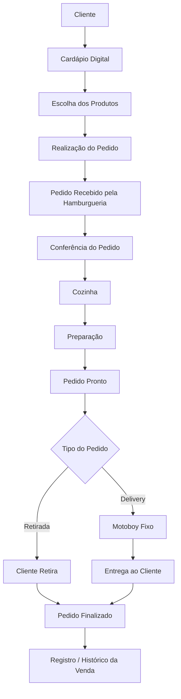
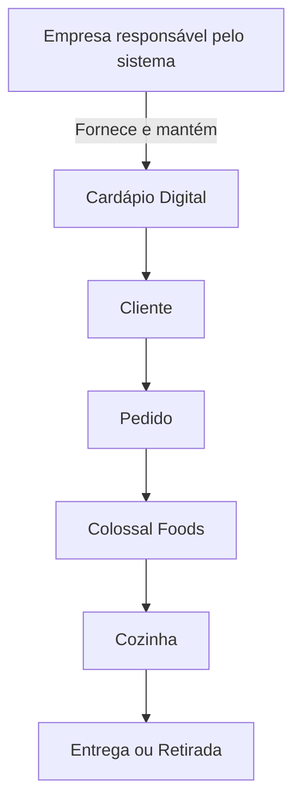
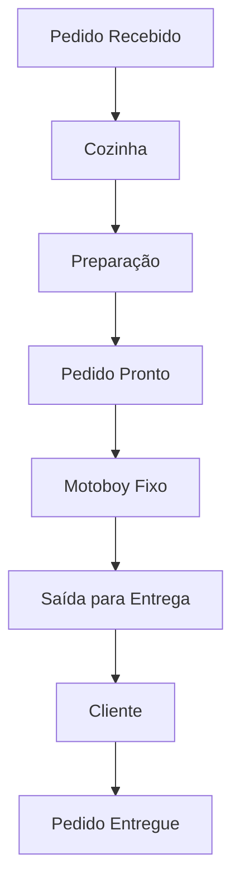
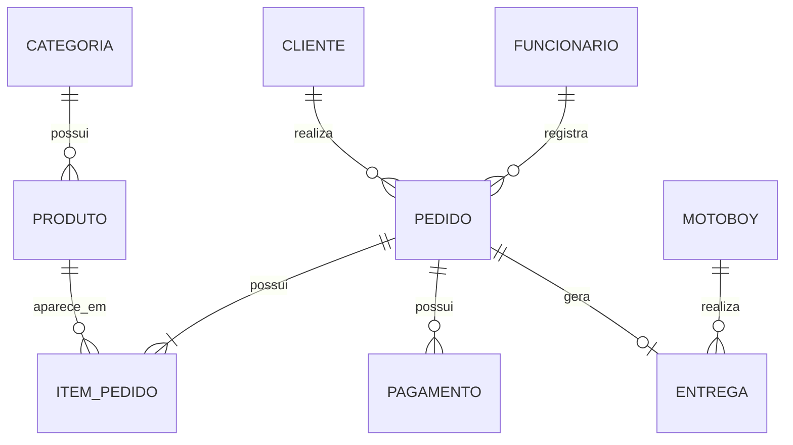
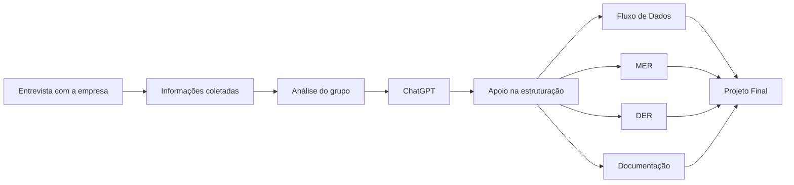

# 🍔 Análise do Sistema de Dados — Colossal Foods

## 📌 Sobre o projeto

Este projeto foi desenvolvido com o objetivo de analisar como funciona o fluxo de informações e dados da **Colossal Foods**, uma hamburgueria de pequeno/médio porte.

A proposta do trabalho é compreender como os dados são gerados durante o atendimento, como os pedidos são processados e como essas informações podem ser representadas por meio de modelagem de dados.

O projeto contempla:

* Levantamento de requisitos;
* Entrevista com a empresa;
* Análise do funcionamento da operação;
* Fluxo de dados;
* MER — Modelo Entidade-Relacionamento;
* DER — Diagrama Entidade-Relacionamento;
* Identificação das principais entidades;
* Relacionamentos entre os dados;
* Possíveis melhorias;
* Utilização de Inteligência Artificial como ferramenta de apoio.

---

# 🏢 Empresa analisada

**Empresa:** Colossal Foods
**Segmento:** Alimentação / Hamburgueria
**Porte:** Pequeno/Médio porte

A Colossal Foods atua com produção e venda de hambúrgueres e outros produtos alimentícios.

Durante o levantamento realizado pelo grupo, foram identificadas algumas características importantes da operação:

* Utilização de um **cardápio digital**;
* O cardápio digital é fornecido por uma empresa terceirizada;
* A Colossal Foods realiza um pagamento mensal pelo uso e manutenção do sistema;
* Os pedidos são recebidos e encaminhados para preparação;
* A cozinha é responsável pela produção dos pedidos;
* Existem pedidos para retirada e delivery;
* A empresa utiliza **motoboy fixo** para realizar as entregas.

---

# 🎯 Objetivo da análise

O objetivo principal foi identificar como as informações percorrem o processo de venda da empresa.

O fluxo começa quando o cliente acessa o cardápio digital e realiza um pedido e termina quando o pedido é entregue ou retirado.

Durante esse processo são geradas e utilizadas informações como:

* Dados do cliente;
* Produtos selecionados;
* Quantidade dos produtos;
* Valor do pedido;
* Forma de pagamento;
* Tipo do pedido;
* Status do pedido;
* Informações de entrega;
* Informações relacionadas ao motoboy.

Esses dados podem ser utilizados para controle operacional, histórico de vendas e apoio à tomada de decisão.

---

# 🔎 Metodologia utilizada

Para compreender o funcionamento da empresa, foi realizada uma entrevista com perguntas relacionadas ao processo de atendimento, funcionamento dos pedidos e utilização dos sistemas.

O projeto foi dividido nas seguintes etapas:

1. Levantamento inicial das informações da empresa;
2. Preparação das perguntas da entrevista;
3. Realização da entrevista;
4. Identificação do fluxo operacional;
5. Identificação dos dados utilizados;
6. Identificação das principais entidades;
7. Construção do fluxo de dados;
8. Construção do MER;
9. Construção do DER;
10. Análise de possíveis melhorias;
11. Organização da documentação.

---

# 🎤 Entrevista

A entrevista foi utilizada para compreender como as informações circulam dentro da empresa.

Algumas perguntas utilizadas durante o levantamento foram:

* Como os clientes realizam os pedidos?
* Qual sistema é utilizado para apresentar o cardápio?
* O sistema do cardápio é próprio ou terceirizado?
* Como os pedidos chegam até a empresa?
* Como o pedido é encaminhado para a cozinha?
* Quais informações do pedido ficam armazenadas?
* Como são registrados os pagamentos?
* Como funciona o processo de delivery?
* A empresa utiliza motoboy próprio ou terceirizado?
* Existe controle de estoque?
* O sistema gera relatórios?
* Quem possui acesso ao sistema?
* Como produtos e preços são atualizados?
* Existe histórico de pedidos?

---

# 🔄 Funcionamento geral da empresa

O processo começa quando o cliente acessa o cardápio digital da Colossal Foods.

O cliente visualiza os produtos disponíveis, escolhe os itens desejados e realiza seu pedido.

As informações do pedido são recebidas pela hamburgueria e utilizadas para iniciar o processo de preparação.

Depois disso, o pedido é encaminhado para a cozinha.

Quando o pedido fica pronto, ele pode seguir dois caminhos principais:

### Retirada

O cliente realiza a retirada do pedido diretamente na hamburgueria.

### Delivery

O pedido é encaminhado para o motoboy fixo utilizado pela empresa.

O motoboy recebe o pedido e realiza a entrega no endereço informado pelo cliente.

Após a retirada ou entrega, o pedido é considerado finalizado.

---

# 🔄 Fluxo principal



---

# 💻 Sistema de cardápio digital

A Colossal Foods utiliza um sistema de cardápio digital fornecido por uma empresa terceirizada.

A hamburgueria realiza um pagamento mensal para utilizar o serviço.

A manutenção técnica da plataforma é de responsabilidade da empresa fornecedora do sistema.

O funcionamento pode ser representado da seguinte maneira:



Esse modelo permite que a Colossal Foods utilize uma solução pronta sem precisar desenvolver e manter internamente todo o sistema de cardápio.

---

# 🛵 Processo de entrega

A empresa utiliza **motoboy fixo** para realizar os pedidos de delivery.

O fluxo da entrega pode ser representado da seguinte forma:



Durante o processo de entrega podem ser utilizados dados como:

* Número do pedido;
* Nome do cliente;
* Endereço;
* Horário de saída;
* Motoboy responsável;
* Status da entrega;
* Horário de conclusão.

---

# 🗃️ Principais entidades identificadas

Com base na análise da empresa, foram identificadas as seguintes entidades principais:

* CLIENTE
* PEDIDO
* ITEM_PEDIDO
* PRODUTO
* CATEGORIA
* PAGAMENTO
* FUNCIONARIO
* MOTOBOY
* ENTREGA

---

# 👤 CLIENTE

Representa a pessoa que realiza o pedido.

Possíveis atributos:

```text
id_cliente
nome
telefone
endereco
email
```

---

# 🧾 PEDIDO

Representa cada compra realizada.

Possíveis atributos:

```text
id_pedido
id_cliente
id_funcionario
data_hora
tipo_pedido
status
valor_total
```

---

# 🍔 PRODUTO

Representa os itens disponíveis no cardápio.

Possíveis atributos:

```text
id_produto
id_categoria
nome
descricao
preco
status
```

---

# 📦 ITEM_PEDIDO

Representa cada produto adicionado dentro de um pedido.

Possíveis atributos:

```text
id_item
id_pedido
id_produto
quantidade
preco_unitario
observacao
```

O campo de observação pode armazenar solicitações como:

```text
Sem cebola
Sem molho
Adicionar bacon
Retirar queijo
```

---

# 💳 PAGAMENTO

Representa as informações financeiras relacionadas ao pedido.

Possíveis atributos:

```text
id_pagamento
id_pedido
forma_pagamento
valor
status
data_hora
```

Exemplos de formas de pagamento:

* PIX;
* Dinheiro;
* Cartão de débito;
* Cartão de crédito.

---

# 👨‍💼 FUNCIONARIO

Representa os colaboradores responsáveis pelo atendimento e operação.

Possíveis atributos:

```text
id_funcionario
nome
cargo
status
```

---

# 🛵 MOTOBOY

Representa o responsável pelas entregas.

Possíveis atributos:

```text
id_motoboy
nome
telefone
status
```

Possíveis status:

```text
Disponível
Em entrega
Indisponível
```

---

# 🚚 ENTREGA

Representa o processo de entrega de um pedido.

Possíveis atributos:

```text
id_entrega
id_pedido
id_motoboy
endereco_entrega
data_hora_saida
data_hora_entrega
status
```

Possíveis status:

```text
Aguardando
Em rota
Entregue
Cancelada
```

---

# 🗂️ CATEGORIA

Representa a categoria de cada produto.

Exemplos:

```text
Hambúrguer
Bebida
Porção
Sobremesa
Combo
```

Possíveis atributos:

```text
id_categoria
nome
descricao
```

---

# 🔗 MER — Modelo Entidade-Relacionamento



---

# 🧩 DER — Estrutura lógica

```text
CLIENTE
-----------------------------
PK id_cliente
nome
telefone
endereco
email


FUNCIONARIO
-----------------------------
PK id_funcionario
nome
cargo
status


CATEGORIA
-----------------------------
PK id_categoria
nome
descricao


PRODUTO
-----------------------------
PK id_produto
FK id_categoria
nome
descricao
preco
status


PEDIDO
-----------------------------
PK id_pedido
FK id_cliente
FK id_funcionario
data_hora
tipo_pedido
status
valor_total


ITEM_PEDIDO
-----------------------------
PK id_item
FK id_pedido
FK id_produto
quantidade
preco_unitario
observacao


PAGAMENTO
-----------------------------
PK id_pagamento
FK id_pedido
forma_pagamento
valor
status
data_hora


MOTOBOY
-----------------------------
PK id_motoboy
nome
telefone
status


ENTREGA
-----------------------------
PK id_entrega
FK id_pedido
FK id_motoboy
endereco_entrega
data_hora_saida
data_hora_entrega
status
```

---

# 📊 Cardinalidades

## Cliente e Pedido

```text
CLIENTE 1 ───── N PEDIDO
```

Um cliente pode realizar vários pedidos.

---

## Funcionário e Pedido

```text
FUNCIONARIO 1 ───── N PEDIDO
```

Um funcionário pode registrar diversos pedidos.

---

## Pedido e Item do Pedido

```text
PEDIDO 1 ───── N ITEM_PEDIDO
```

Um pedido pode possuir vários produtos.

---

## Produto e Item do Pedido

```text
PRODUTO 1 ───── N ITEM_PEDIDO
```

Um mesmo produto pode aparecer em diversos pedidos.

---

## Categoria e Produto

```text
CATEGORIA 1 ───── N PRODUTO
```

Uma categoria pode conter vários produtos.

---

## Pedido e Pagamento

```text
PEDIDO 1 ───── N PAGAMENTO
```

Essa estrutura permite que um pedido possa possuir mais de um registro de pagamento, caso exista pagamento dividido.

---

## Pedido e Entrega

```text
PEDIDO 1 ───── 0..1 ENTREGA
```

Nem todo pedido possui entrega.

Pedidos retirados diretamente pelo cliente não precisam gerar um registro de entrega.

---

## Motoboy e Entrega

```text
MOTOBOY 1 ───── N ENTREGA
```

Um motoboy pode realizar várias entregas ao longo do tempo.

---

# 📈 Possíveis informações geradas

A partir da estrutura proposta, seria possível gerar indicadores como:

* Quantidade de pedidos;
* Faturamento diário;
* Faturamento mensal;
* Ticket médio;
* Produtos mais vendidos;
* Categorias mais vendidas;
* Formas de pagamento mais utilizadas;
* Quantidade de pedidos de delivery;
* Quantidade de pedidos para retirada;
* Horários de maior movimento;
* Histórico de pedidos;
* Quantidade de entregas realizadas;
* Tempo médio de entrega.

---

# 🚀 Possíveis melhorias

Durante a análise, também foram identificadas possíveis oportunidades de melhoria.

## Centralização das informações

Uma possível melhoria seria concentrar informações de pedidos, pagamentos e entregas em um único ambiente.

Isso poderia facilitar o acompanhamento da operação e reduzir retrabalho.

---

## Dashboard gerencial

Também poderia ser criado um painel para acompanhamento de indicadores.

Exemplo:

```text
Faturamento
Quantidade de pedidos
Ticket médio
Produtos mais vendidos
Horários de maior movimento
Pedidos por canal
Quantidade de deliveries
```

---

## Histórico de entregas

O registro estruturado das entregas poderia permitir análises como:

```text
Quantidade de entregas
Tempo médio de entrega
Pedidos por região
Histórico do motoboy
```

---

# 🤖 Utilização de Inteligência Artificial

Durante o desenvolvimento deste projeto foi utilizada **Inteligência Artificial por meio do ChatGPT, da OpenAI**, como ferramenta de apoio.

A IA foi utilizada principalmente para:

* Auxiliar na elaboração das perguntas utilizadas na entrevista;
* Organizar as informações coletadas pelo grupo;
* Apoiar na identificação das possíveis entidades;
* Auxiliar na definição dos relacionamentos;
* Estruturar o fluxo de dados;
* Auxiliar na construção do MER;
* Auxiliar na construção do DER;
* Organizar a documentação;
* Melhorar a apresentação das informações no GitHub.

A Inteligência Artificial foi utilizada como uma ferramenta de suporte ao desenvolvimento do projeto.

As informações referentes ao funcionamento da Colossal Foods foram obtidas por meio do levantamento e da entrevista realizada pelo grupo.

O ChatGPT auxiliou principalmente na **organização, estruturação e representação das informações coletadas**.

---

# 🧠 IA no processo de desenvolvimento



---

# ⚠️ Observação sobre a modelagem

Parte das informações apresentadas no MER e no DER representa uma **modelagem proposta pelo grupo com base nas informações levantadas durante a entrevista e no funcionamento observado da empresa**.

Alguns atributos e relacionamentos representam como os dados poderiam ser organizados em um banco de dados estruturado.

Isso não significa necessariamente que o sistema terceirizado atualmente utilizado pela Colossal Foods possua exatamente essa estrutura interna.

O objetivo é representar de maneira lógica o funcionamento da operação e os principais dados envolvidos.

---

# 🛠️ Ferramentas e conceitos utilizados

Durante o desenvolvimento foram utilizados:

* GitHub;
* Markdown;
* Mermaid;
* ChatGPT;
* Modelagem de Banco de Dados;
* MER;
* DER;
* Levantamento de Requisitos;
* Entrevista;
* Análise de Sistemas.

---

# 📚 Conhecimentos aplicados

O projeto envolveu conhecimentos relacionados a:

* Banco de Dados;
* Engenharia de Requisitos;
* Análise e Desenvolvimento de Sistemas;
* Modelagem de Dados;
* Modelo Entidade-Relacionamento;
* Diagrama Entidade-Relacionamento;
* Fluxo de Dados;
* Inteligência Artificial aplicada ao desenvolvimento de projetos.

---

# 👥 Integrantes do projeto

Este projeto foi desenvolvido em grupo como parte de uma atividade acadêmica do curso de **Análise e Desenvolvimento de Sistemas**.

Integrantes:

* **Murilo Silva Magalhães**
* **Kauê de Lima Pereira**
* **Kauê Gregorio dos Santos**

O trabalho foi desenvolvido de forma colaborativa, envolvendo entrevista, levantamento de informações, análise do funcionamento da empresa, discussão das entidades, construção dos modelos e organização da documentação.

---

# ✅ Conclusão

A análise da Colossal Foods permitiu compreender como diferentes informações participam do processo de funcionamento de uma hamburgueria.

O pedido funciona como um dos principais elementos do processo, relacionando informações sobre clientes, produtos, pagamentos e entregas.

A utilização do MER e do DER permitiu representar de forma estruturada como essas informações podem ser organizadas em um banco de dados.

O projeto também demonstrou a importância do levantamento de requisitos antes da construção de uma solução.

Além disso, a utilização de Inteligência Artificial mostrou como ferramentas como o ChatGPT podem apoiar atividades de organização, análise, documentação e modelagem, enquanto as decisões e informações principais permanecem baseadas na análise realizada pelo grupo e na entrevista com a empresa.
