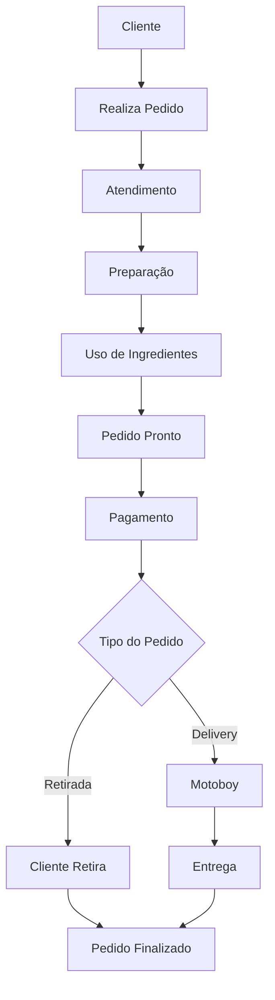
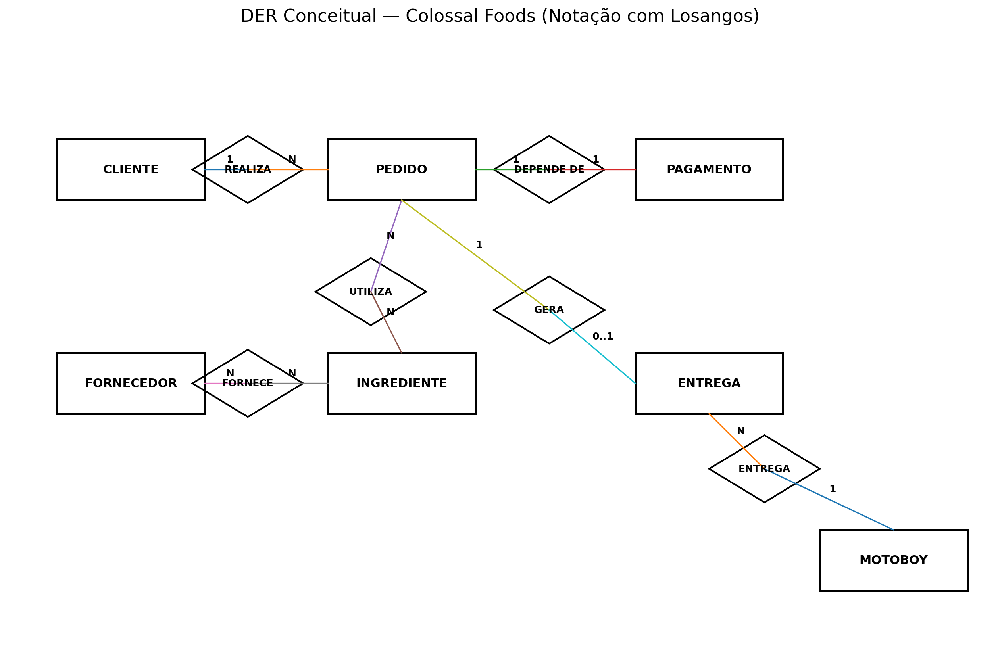

# Entrega 1 — Modelo Conceitual (DER)
### Modelagem de um sistema de gestão de informações para uma organização de pequeno porte

---

## Metadados

- **Murilo Silva Magalhães — RGM: 47820471**
- **Kauê de Lima Pereira — RGM: 48477940**
- **Kauê Gregorio dos Santos — RGM: 47908904**

---

## 1. Caracterização da Organização

- **Nome e natureza da organização:** **Colossal Foods**, empresa privada com fins lucrativos do segmento de alimentação/hamburgueria.

- **Contexto e porte:** A Colossal Foods é uma hamburgueria de pequeno/médio porte localizada no Jardim Arantes, em São Paulo. Durante a pesquisa de campo, o grupo identificou **4 funcionários diretamente envolvidos na operação interna**, sendo **2 funcionários na chapa/preparação** e **2 funcionários no atendimento ao público**. A empresa também utiliza **motoboy fixo** para as entregas.

- **Problemas e necessidades identificados:** Para o escopo do projeto, foi identificada a necessidade de organizar informações relacionadas a clientes, pedidos, pagamentos, ingredientes, fornecedores e entregas. A modelagem busca representar essas informações de forma estruturada e coerente com os processos observados.

- **Justificativa da escolha:** A organização foi escolhida por ser real, acessível ao grupo para pesquisa de campo e possuir processos suficientes para aplicação dos conceitos de modelagem conceitual de dados.

- **Evidências da organização:** A Colossal Foods possui presença pública no Google e o grupo realizou pesquisa de campo diretamente na organização. As fotos da visita devem ser anexadas ao repositório como evidência.

---

## 2. Processos de Negócio

### Principais processos mapeados

1. Atendimento ao cliente.
2. Realização e registro do pedido.
3. Preparação do pedido na chapa.
4. Uso e consumo de ingredientes.
5. Registro do pagamento.
6. Compra/abastecimento de ingredientes por fornecedores.
7. Retirada no estabelecimento ou entrega por motoboy.
8. Finalização do pedido.

### Fluxograma

---

## 3. Requisitos do Sistema

### 3.1 Requisitos Funcionais

- **RF01 —** O sistema deve permitir registrar clientes.
- **RF02 —** O sistema deve permitir registrar pedidos.
- **RF03 —** O sistema deve permitir registrar os ingredientes utilizados na operação.
- **RF04 —** O sistema deve permitir cadastrar fornecedores.
- **RF05 —** O sistema deve permitir relacionar fornecedores aos ingredientes fornecidos.
- **RF06 —** O sistema deve permitir relacionar ingredientes aos pedidos em que foram utilizados.
- **RF07 —** O sistema deve permitir registrar o pagamento de cada pedido.
- **RF08 —** O sistema deve identificar se o pedido é para retirada ou delivery.
- **RF09 —** O sistema deve permitir registrar entregas.
- **RF10 —** O sistema deve permitir associar um motoboy a uma entrega.
- **RF11 —** O sistema deve manter histórico dos pedidos.

### 3.2 Requisitos Não Funcionais

- **RNF01 — Usabilidade:** interface simples para uso na rotina da hamburgueria.
- **RNF02 — Segurança:** acesso controlado aos dados.
- **RNF03 — Disponibilidade:** sistema disponível durante o horário de funcionamento.
- **RNF04 — Integridade:** relacionamentos entre pedidos, pagamentos, ingredientes, fornecedores e entregas devem permanecer consistentes.
- **RNF05 — Privacidade:** dados pessoais devem ser tratados apenas para finalidades operacionais.

---

## 4. Regras de Negócio

### Regras operacionais

- **RN01 —** Um cliente pode realizar vários pedidos.
- **RN02 —** Cada pedido pertence a um cliente.
- **RN03 —** Um pedido pode utilizar vários ingredientes.
- **RN04 —** Um ingrediente pode ser utilizado em vários pedidos.
- **RN05 —** Um fornecedor pode fornecer vários ingredientes.
- **RN06 —** Um ingrediente pode ser fornecido por um ou mais fornecedores.
- **RN07 —** Cada pedido deve possuir um pagamento associado.
- **RN08 —** Cada pagamento deve estar associado a um único pedido.
- **RN09 —** Um pedido pode ser do tipo retirada ou delivery.
- **RN10 —** Somente pedidos de delivery geram entrega.
- **RN11 —** Cada entrega deve possuir um motoboy responsável.
- **RN12 —** Um motoboy pode realizar várias entregas.

### Restrições organizacionais

- O cardápio digital utilizado pela empresa é terceirizado.
- O grupo não possui acesso ao banco de dados interno do sistema contratado.
- A empresa utiliza motoboy fixo.
- O modelo conceitual representa os processos observados e as necessidades de informação do projeto.

---

## 5. Dicionário de Dados Conceitual (Preliminar)

O dicionário completo está disponível no arquivo:

**[`dicionario-dados.html`](dicionario-dados.html)**

As entidades contempladas são:

- CLIENTE
- PEDIDO
- PAGAMENTO
- INGREDIENTE
- FORNECEDOR
- MOTOBOY
- ENTREGA

---

## 6. Modelagem Conceitual (Entidades, Atributos, Relacionamentos)

### Entidades reconhecidas

- **CLIENTE:** pessoa que realiza o pedido.
- **PEDIDO:** representa a solicitação realizada pelo cliente.
- **PAGAMENTO:** representa a quitação financeira associada ao pedido.
- **INGREDIENTE:** representa os insumos utilizados na preparação.
- **FORNECEDOR:** representa quem fornece ingredientes para a hamburgueria.
- **MOTOBOY:** responsável pelas entregas.
- **ENTREGA:** representa o processo de delivery.

### Relacionamentos

- **CLIENTE — REALIZA — PEDIDO:** 1:N
- **PEDIDO — UTILIZA — INGREDIENTE:** N:N
- **FORNECEDOR — FORNECE — INGREDIENTE:** N:N
- **PEDIDO — DEPENDE_DE — PAGAMENTO:** 1:1
- **PEDIDO — GERA — ENTREGA:** 1:0..1
- **MOTOBOY — REALIZA — ENTREGA:** 1:N

O relacionamento N:N entre PEDIDO e INGREDIENTE é mantido diretamente no modelo conceitual, sem criar a entidade ITEM_PEDIDO. A transformação desse relacionamento para tabelas associativas será tratada somente na etapa de modelagem lógica.

---

## 7. Diagrama Entidade-Relacionamento (DER)

O DER conceitual está anexado em:

**[`diagramas/DER-Colossal-Foods-Corrigido.png`](diagramas/DER-Colossal-Foods-Corrigido.png)**

O diagrama utiliza **losangos para representar os relacionamentos**, conforme a notação conceitual.

---

## 8. Justificativa Técnica

O modelo foi ajustado para representar a organização em nível conceitual, sem antecipar estruturas próprias do modelo lógico.

A entidade **ITEM_PEDIDO** foi removida. No modelo conceitual, o relacionamento entre **PEDIDO** e **INGREDIENTE** pode ser representado diretamente como muitos-para-muitos por meio do relacionamento **UTILIZA**. Caso o projeto avance para o modelo lógico, esse relacionamento poderá ser convertido em uma tabela associativa.

As entidades **FORNECEDOR** e **INGREDIENTE** foram incluídas porque fazem parte do funcionamento real de uma hamburgueria: ingredientes são utilizados na preparação e precisam ser obtidos junto a fornecedores.

O relacionamento **FORNECE** foi definido como N:N, pois um fornecedor pode fornecer vários ingredientes e o mesmo ingrediente pode, conceitualmente, ser adquirido de fornecedores diferentes.

O relacionamento entre **PEDIDO** e **PAGAMENTO** foi definido como 1:1 para indicar que cada pedido possui um pagamento associado e cada pagamento se refere a um único pedido.

A entidade **ENTREGA** continua separada de PEDIDO porque somente pedidos do tipo delivery necessitam de entrega. Assim, um pedido pode gerar nenhuma ou uma entrega.

O **MOTOBOY** foi mantido porque representa um elemento real do processo de delivery observado na organização.

---

## 9. Uso de Inteligência Artificial

O grupo utilizou **ChatGPT, da OpenAI**, como ferramenta de apoio.

| Item | Registro |
|---|---|
| **Ferramenta e etapa** | ChatGPT — preparação da entrevista, organização da modelagem e documentação |
| **Motivação** | Apoiar o grupo na estruturação das perguntas, requisitos, entidades, relacionamentos e README |
| **Prompts utilizados** | “Chat, preciso fazer uma entrevista com uma empresa e entender como funciona o sistema deles de dados e montar um fluxo e fazer um MER e DER.”; “A empresa é uma hamburgueria de baixo/médio porte, é possível adiantar algo?”; “Mude o arquivo para esse formato: Entrega 1 — Modelo Conceitual (DER).” |
| **Resposta recebida** | A IA sugeriu perguntas, entidades e estruturas iniciais de relacionamento |
| **Fontes consultadas e verificadas** | Pesquisa de campo na Colossal Foods e informações públicas da organização |
| **Trechos rejeitados ou corrigidos** | ITEM_PEDIDO foi retirado; FORNECEDOR e INGREDIENTE foram incluídos; hipóteses não confirmadas foram removidas |
| **Justificativa da escolha final** | O grupo adaptou as sugestões ao funcionamento observado e às orientações recebidas |
| **Reflexão crítica** | A IA pode sugerir estruturas genéricas do setor. Por isso, as sugestões foram tratadas como apoio e revisadas manualmente |

---

## Critérios Atitudinais (20%)

Os critérios atitudinais serão demonstrados por meio da participação dos integrantes e do histórico de commits no GitHub.

---

## Resumo dos Pesos

| Dimensão | Peso total |
|----------|-----------|
| Conceitual (contexto, requisitos/regras, modelagem, justificativa técnica) | 30% |
| Procedimental (requisitos, fluxogramas, dicionário de dados, DER) | 50% |
| Atitudinal (participação, comprometimento, colaboração, autonomia) | 20% |

**Entrega final:** `README.md` completo + DER em imagem + Dicionário de Dados em HTML anexados ao repositório GitHub do grupo.
